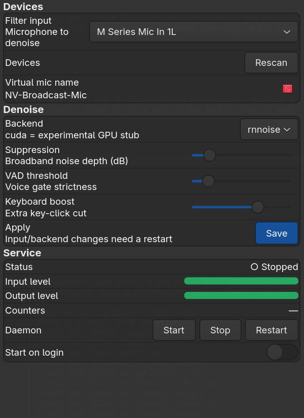

# nv-broadcast-linux — NVIDIA Broadcast alternative for Linux (Omarchy/Arch + PipeWire)

Virtual denoised microphone: captures a real input, suppresses keyboard typing
and background noise, publishes a `NV-Broadcast-Mic` source other apps select.

## Architecture (why C++ + optional CUDA)

- **C++17** is the native language for everything here: PipeWire (`libpipewire`),
  RNNoise (`librnnoise`), and every NVIDIA GPU path (CUDA Toolkit, TensorRT,
  NVIDIA Maxine Audio Effects SDK) are C/C++ APIs. Rust's CUDA story
  (`rust-cuda`, `cudarc`) is immature and would just FFI back into C++ anyway.
- **Phase 1 (this scaffold, works today):** RNNoise denoiser on CPU. This is what
  NoiseTorch uses; it is excellent at keyboard click + broadband background
  suppression at 48 kHz, ~10 ms frames, negligible CPU.
- **Phase 2 (GPU):** `src/cuda_backend.*` is the seam. Drop in either
  DeepFilterNet via ONNX Runtime `--use_cuda`, or NVIDIA Maxine Audio Effects
  SDK (`nv_audio_effects`) behind the `Denoiser` interface. No daemon/CLI
  changes needed.

## What you need to install (Omarchy = Arch)

You already have: RTX 3090, `nvidia-open-dkms 610.x`, `nvidia-utils`,
`pipewire 1.6.x`, `libpipewire`, `rnnoise`, `g++`.

```bash
# 1. Confirm the driver on a HOST terminal (sandbox hides /dev/nvidia*,
#    so nvidia-smi fails inside this workspace even when the driver is fine):
nvidia-smi   # expect your RTX 3090 listed

# 2. Build tools + PipeWire/RNNoise dev files (most already present):
sudo pacman -S --needed base-devel cmake pkgconf pipewire libpipewire \
  pipewire-pulse wireplumber rnnoise

# 3. OPTIONAL, only for the Phase-2 GPU backend (~4.7 GB installed):
sudo pacman -S cuda                # nvcc, cudart, cublas
# OR minimal runtime if you never compile CUDA code:
# sudo pacman -S opencl-nvidia nvidia-utils

# 4. Build this project:
cmake -B build -DCMAKE_BUILD_TYPE=Release
cmake --build build -j"$(nproc)"
# With CUDA toolkit present:
# cmake -B build -DENABLE_CUDA=ON -DCMAKE_BUILD_TYPE=Release
```

`nvidia-smi` failing with "couldn't communicate with the NVIDIA driver" while
`lspci -nnk` shows `Kernel driver in use: nvidia` almost always means you are
in a container/sandbox without `/dev/nvidia*`, or you updated the kernel
without rebooting (`nvidia-open-dkms` rebuilds on boot). Reboot after kernel
updates, then re-run `nvidia-smi` in a normal terminal.

## Usage

```bash
# copy + edit config
mkdir -p ~/.config/nv-broadcast
cp config.example.toml ~/.config/nv-broadcast/config.toml
$EDITOR ~/.config/nv-broadcast/config.toml

# scan sound devices (reads PipeWire via pw-dump/pactl, no daemon needed)
./build/nvbcast list

# point the filter at your mic
./build/nvbcast set-input alsa_input.usb-XXXX.analog-stereo
./build/nvbcast status

# run the filter in the foreground (creates "NV-Broadcast-Mic")
./build/nvbcastd

# install + enable as a user service (virtual mic on every login)
./scripts/install.sh
systemctl --user enable --now nv-broadcast.service
# then select "NV-Broadcast-Mic" as input in Discord/Zoom/Chrome/etc.
```

Tuning for keyboard noise: `suppression_db`, `vad_threshold`, and
`keyboard_boost` in the config. Higher `keyboard_boost` (0.0–1.0) applies
extra attenuation on detected key-click transients.

## GUI



```bash
sudo pacman -S --needed gtk4 libadwaita   # dev files for the GUI target
cmake -B build -DCMAKE_BUILD_TYPE=Release && cmake --build build -j
./build/nvbcast-gui
```

Device dropdown, denoise sliders, Start/Stop/Restart, start-on-login switch,
and live input/output meters + counters. Meters are fed by the daemon's
status file (`$XDG_RUNTIME_DIR/nv-broadcast-status.json`, 5 Hz); `nvbcast
status` shows the same telemetry in the terminal.

## Layout

```
CMakeLists.txt            nvbcastd (daemon) + nvbcast (CLI)
config.example.toml       documented config
src/denoiser.h            Denoiser interface (RNNoise now, CUDA later)
src/rnnoise_backend.*     RNNoise implementation
src/cuda_backend.*        GPU stub — implement DeepFilterNet/Maxine here
src/common/config.*       TOML-subset config load/save (no external dep)
src/common/devices.*      device scan via pw-dump/pactl
src/nvbcastd.cpp          daemon: capture -> denoise -> virtual source
src/nvbcast.cpp           CLI: list/get/set/enable/disable/status
systemd/nv-broadcast.service
scripts/install.sh
```

## Maxine GPU backend (Broadcast-quality)

```bash
# 1. NVIDIA Developer account -> download Audio Effects SDK for Linux
#    (accept the Maxine EULA) -> extract:
mkdir -p ~/.local/share/nv-broadcast
tar xf Audio_Effects_SDK_Linux.tar.gz -C ~/.local/share/nv-broadcast/maxine
# expect: maxine/lib/libnv_audio_effects.so, maxine/models/denoiser_48k.trtpkg

# 2. If the .so complains about missing libcudart:
sudo pacman -S cuda   # full toolkit; only needed if ldd shows cudart missing

# 3. Switch backends (GUI, or CLI):
nvbcast set backend maxine
nvbcast set maxine_model denoiser_48k   # shorthand for the path above
systemctl --user restart nv-broadcast.service
```

No rebuild needed — the backend loads `libnv_audio_effects.so` at runtime.
First `Load()` takes a few seconds and ~0.5 GB VRAM on the 3090. If a param
name mismatches your SDK version, the daemon prints the numeric status for
that exact call — paste it back and the key gets corrected.

## Notes / limits

- Daemon frame size is 480 samples @ 48 kHz (10 ms), RNNoise-native. Input is
  resampled to 48 kHz mono in the full implementation; this scaffold passes
  through the processing hook so it builds and runs without a live PipeWire
  graph in CI/sandbox.
- NVIDIA publishes no Linux Broadcast binary. The "RTX features" path on Linux
  is the Maxine Audio Effects SDK (proprietary, Turing+ including your 3090).
  The `Denoiser` interface isolates that swap.
